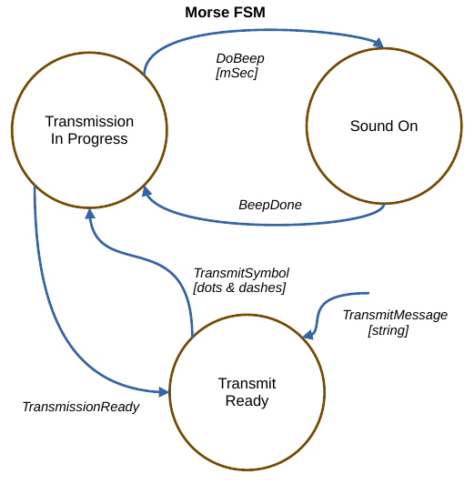
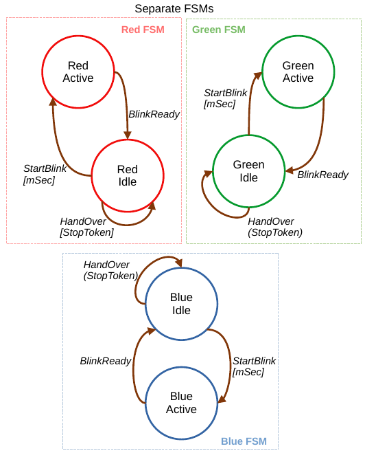
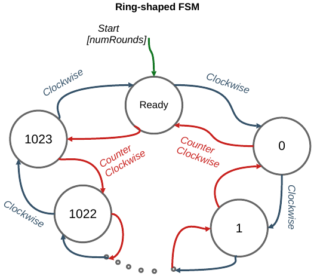

# CoFSM - A Finite State Machine library based on Coroutine Symmetric Transfer
CoFSM is a C++20 header-only Finite State Machine library.
The states are represented as coroutines which `co_await` for events.
This makes it possible to do things like
- Suspend the execution of FSM and later resume either from the state where it left off when it was suspended, or from another other state (see the [first example](#first-example)).
- Make changes to the transition table during the life-time of the FSM object (see [this example](#example-connect-and-separate-fsms-running-in-separate-threads-in-runtime)).
- Programmatically create arbitrarily many states and arbitrarily large transition tables without manual configuration (see [this example](#example-configure-an-fsm-programmatically-and-measure-the-speed-of-execution)).
- Connect and disconnect FSMs living in separate source files without having to recompile everything. So a state in one FSM can send an event to a state in another FSM (see [this example](#example-connect-and-separate-fsms-running-in-separate-threads-in-runtime)).
- Suspend the execution of the FSM in one thread and resume in another thread.

Events are light-weight objects consisting of a name and an optional data buffer.
Neither the states nor the events need to be inherited from a common base class.

The library uses [symmetric transfer](https://lewissbaker.github.io/2020/05/11/understanding_symmetric_transfer)
in transiting from one state to another. This makes the transitions quite fast. More on speed measurements [in this example](#example-configure-an-fsm-programmatically-and-measure-the-speed-of-execution).

It is often difficult to track the transition pattern in a complicated FSM. Symmetric transfer makes it easy to inject logger code into the transfer point where the control is handed over from one state to another to track sequence of events _("State A at time T sent event E which was received by state B")_. This is demonstrated in the examples below.

Coroutines generally use heap to store the local variables and other stuff for internal book keeping. Heap allocations take place only when the FSM is being configured.
During the running of the state machine, the library does not allocate or free memory (unless the business logic within the state coroutine does so.)

## Examples

### First example

Let's first walk through a simple example with only two states.

We have states called Ping and Pong. Ping sends to Pong an event which contains a counter value.
Pong decrements the counter and if it is positive, returns the event to Ping with the decremented counter value.
The Ping does the same until the counter becomes zero, after which the FSM is suspended.


The numbered points #1, #2,... in comments are explained below the code.
```c++
#include <iostream>
#include <CoFSM.h>

using CoFSM::FSM;
using CoFSM::Event;
using CoFSM::State;
using std::cout;

State statePing(CoFSM::FSM& fsm)  // #1
{
    Event event = co_await fsm.getEvent();  // #2
    while (true) {
        if (int* pCounter; event == "ToPingEvent")  // #3
        {
            event >> pCounter;  // #4
            if (*pCounter > 0) // Send the event back to Pong
                event.construct("ToPongEvent", *pCounter - 1);  // #5
            else // Send an empty event to suspend the FSM
                event.destroy();  // #6
        }
        else  // The event was not recognized.
            throw std::runtime_error("Unrecognized event '" + event.nameAsString() + "' received in state " + fsm.currentState());
        event = co_await fsm.emitAndReceive(&event);  // #7
    }
}

State statePong(CoFSM::FSM& fsm)
{
/* ... The same as statePing except that words Ping and Pong are swapped ... */
}

```
- **#1** A state coroutine can have any number of arguments.
One of the arguments must be a modifiable reference to the FSM object which is driving the state.
The return type is always `CoFSM::State`.
- **#2** co_await for the first event.
- **#3** Resolve the identity of the incoming event.
- **#4** If the event has data attached, a pointer to the data is acquired simply by saying `event >> pData`.
In this case, the data is an integer counter.
- **#5** Events are reusable. A new name and new data can be attached to an existing event.
If the new data needs more space than the old one, the storage of the event is automatically expanded.
- **#6** The event can also be cleared to make it empty and nameless. Sending such an event will suspend the FSM.
The `Event` type is explained more thoroughly [below](#cofsmevent).
- **#7** Now the event is ready to be sent. `fsm.emitAndReceive` will dispatch the current event and suspend the state.
When another state later sends an event which is routed to this state, this state will be be resumed and
`fsm.emitAndReceive` returns with the new event.

```c++
// debug helper which tracks the transitions within an FSM.
struct Logger  // #8
{
    std::ostream& str;
    void operator()(const FSM& fsm, const std::string& fromState, const Event& onEvent, const std::string& toState)
    {
        str << " [" << fsm.name() <<"] '" << onEvent.name()
            << "' sent from '" << fromState << "' --> '" << toState << "'\n";
    }
};

FSM& setup(FSM& fsm)  // #9
{
    using namespace CoFSM;

    // Make and name the states
    fsm << (statePing(fsm) = "pingState")   // #10
        << (statePong(fsm) = "pongState");

    // Set the transition table.
    fsm << transition("pingState", "ToPongEvent", "pongState")  // #11
        << transition("pongState", "ToPingEvent", "pingState");

    // List the states (for demonstration only)
    cout << "'" << fsm.name() << "' has " << fsm.numberOfStates() << " states.\n";
    cout << "The states are:\n";
    for (unsigned i = 0; i < fsm.numberOfStates(); ++i)
        cout << "  (" << i << ") " << fsm.getStateAt(i).getName() << '\n';

    // List the transitions (for demonstration only)
    cout << "The transitions are:\n";
    auto allTransitions = fsm.getTransitions();
    for (const auto& tr : allTransitions) // tr is an array of 3 string_views (from, event, to)
        cout << "  {" << tr[0] << ',' << tr[1] << "} --> " << tr[2] << '\n';

    fsm.logger = Logger{std::cerr};  // #12
    return fsm;
}
```
- **#8** Define a helper which will be used to track the transitions when the FSM is running. This is for demonstration only and can be omitted.
- **#9** Setup function will register the states and transitions into the FSM.
- **#10** Fire up the state coroutines, give the states symbolic names and register them into the FSM. At this point, the state coroutines remain suspended.
- **#11** Set the transition table so that when "ping" state sends "ToPong" event, it will be routed to "pong" state. And vice versa.
- **#12** Register a logger which tracks the transitions and greatly helps understand what is going in the state machine. This and the listings of the states and transitions before #12 are needed for debugging only.
```c++
int main()
{
    FSM fsm{"PingPongFSM"}; // #13
    setup(fsm).start();     // #14
    Event e;                // #15

    cout << "\nRunning...\n";
    e.construct("ToPingEvent", 2);              // #16
    fsm.setState("pingState").sendEvent(&e);    // #17

    cout << fsm.name() << " suspended at state " << fsm.currentState() << '\n'; // #18

    cout << "\nRunning...\n";       // #19
    e.construct("ToPongEvent", 2);
    fsm.setState("pongState").sendEvent(&e);

    // Now we should be back at Pong state.
    cout << fsm.name() << " suspended at state " << fsm.currentState() << '\n';

 return 0;
}
```
- **#13** Define the FSM object and give it an optional symbolic name.
- **#14** Set up the states and the transition table and resume the state coroutines from the initial suspend. The states are now co_await'ing for the first event.
- **#15** Define the event with which the FSM will soon be started.
- **#16** Give the event a name and set the data.
Remember from the state coroutine above that the data is a counter which says how many times the ping and pong states will exchange events.
- **#17** Set the initial state as "ping" and send the first event. Ping state will resume, receive the event and the FSM will start running.
- **#18** `sendEvent` returns when the FSM is time suspended. In this case it happens when the states have ping-pong'ed the events back and forth twice.
- **#19**  Run the FSM again by repeating steps **#16** - **#18** but this time starting from "pong" state.

**Output:**
```
'PingPongFSM' has 2 states.
The states are:
  (0) pingState
  (1) pongState
The transitions are:
  {pongState,ToPingEvent} --> pingState
  {pingState,ToPongEvent} --> pongState

Running...
 [PingPongFSM] 'ToPongEvent' sent from 'pingState' --> 'pongState'
 [PingPongFSM] 'ToPingEvent' sent from 'pongState' --> 'pingState'
PingPongFSM suspended at state pingState

Running...
 [PingPongFSM] 'ToPingEvent' sent from 'pongState' --> 'pingState'
 [PingPongFSM] 'ToPongEvent' sent from 'pingState' --> 'pongState'
PingPongFSM suspended at state pongState
*** Exited normally ***
```
Runnable code and makefile can be found in folder [fsm-example-ping-pong](examples/fsm-example-ping-pong)

### Example: Morse code transmitter

Let's take another example.
In keeping with the tradition of ridiculous toy examples, we implement morse code transmitter as a finite state machine. A silly overkill? Well, yes, but here we go anyway to demonstrate how HW access can be granted to state coroutines when the FSM is configured.

If you run it on Linux laptop with `sudo` access, the morse code will be transmitted by flickering
Caps Lock / Num Lock / Scroll Lock LEDs in the keyboard.
It should look like this:


If you don't have `sudo` access, the dots and dashes will appear on display.

The state diagram goes like this.



Let's look at the prototypes and functionalities of these three states.

`State transmitReadyState(FSM& fsm)` receives the message (a string of characters) to transmit in `TransmitMessageEvent`.
It splits the message into Morse symbols (strings of dots and dashes) and sends them off one by one in `TransmitSymbolEvent`.
When a symbol has been transmitted, `TransmissionReadyEvent` is received. See lines 145-187 in [fsm-example-morse](examples/fsm-example-morse/fsm-example-morse.cc).

`State transmissionInProgressState(FSM& fsm, int speedWordsPerMinute)` takes care of transmitting the morse symbols at the speed that was given as a parameter when the state coroutine was initialized. On receiving a  `TransmitMessageEvent`, it splits the morse symbol into constituent dots and dashes. For each dot and dash, it sends a `DoBeepEvent` which contains the number of milliseconds the sound will be on.
This state does not care how the 'sound' is actually implemented. In our case, there will be a flicker of LED or a dot/dash on display instead of audible sound. Once the dot/dash has been done, `BeebDoneEvent` is received. When all dot and dashes have been transmitted, a `TransmissionReadyEvent` is sent.
See lines 98-142 in [fsm-example-morse](examples/fsm-example-morse/fsm-example-morse.cc).

`State soundOnState(FSM& fsm, SoundControl* soundControl)` is aware of the HW which sounds the beep (or does something else.)
Pointer to HW control was given as a parameter when the state coroutine was initialized.
It receives a `DoBeepEvent`, turns the sound on and waits for the number of milliseconds given in the event. It then turns the sound off and sends `BeepDoneEvent`.
See lines 77-94 in [fsm-example-morse](examples/fsm-example-morse/fsm-example-morse.cc).

The FSM object, the states and the transition table is defined like so:
```c++
    FSM morse{"Morse FSM"};

    // Register the state coroutines and give them names.
    morse << (transmitReadyState(morse) = "transmitReady")
          << (transmissionInProgressState(morse, wordsPerMinute) = "transmissionInProgress")
          << (soundOnState(morse, &soundController) = "soundOn");

    // Configure the transition table in format ("From State", "Event", "To State")
    // Example: "TransmitSymbolEvent" sent from state "transmitReady" goes to state "transmissionInProgress"
    morse << transition("transmitReady", "TransmitSymbolEvent", "transmissionInProgress")
          << transition("transmissionInProgress", "TransmissionReadyEvent", "transmitReady")
          << transition("transmissionInProgress", "DoBeepEvent", "soundOn")
          << transition("soundOn", "BeebDoneEvent", "transmissionInProgress");
```
The states are started (i.e. run until the first `co_await`) and the initial state is set to `transmitReady`.
```c++
    // Launch the state coroutines and set the initial state.
    morse.start().setState("transmitReady");
```
And that's it. Now we only need to define an `Event`, attach a string which contains the message and send it off.

```c++
    Event e;

    std::string message = "HELLO WORLD";
    e.construct("TransmitMessageEvent", message);
    morse.sendEvent(&e);
```
See `main()` in [fsm-example-morse.cc](examples/fsm-example-morse/fsm-example-morse.cc).

Runnable code and the makefile can be found in folder [fsm-example-morse](examples/fsm-example-morse).

If you are using a Linux laptop with `sudo` access, run command  `make linux && sudo ./fsm-example-morse`  <br>
Otherwise, run  `make all && sudo ./fsm-example-morse` <br>
Run `make clean` in between if you switch between linux and non-linux builds.

### Example: Connect and separate FSMs running in separate threads in runtime

In this example we demonstrate how three independent FSMs can be joined together to form a single larger FSM and how they can be separated again into independent state machines.

Suppose you have three LEDs: red, green and blue. Each LED is controlled by a separate state machine, living in a sepate source file. If one changes, it is not necessary to recompile the others.
The logic of the FSMs is simple. Each FSM has two states, `Active` and `Idle`.
When the Idle state sends `StartBlinkEvent` to the Active state, the LED will be on for the number of milliseconds given on the event.
Then the LED is turned off and a `BlinkReadyEvent` is sent back to the Idle state.

The _LED on - LED off_ loop starts when the Idle state receives `HandOverEvent`. This event contains a [stop token](https://en.cppreference.com/w/cpp/thread/stop_token) which determines whether the on-off cycle continues or the FSM is suspended. After each on-off cycle, the Idle state forwards the stop token to the recipient of `HandOverEvent`.

The point of this example is to demonstrate that if the HandoverEvents are routed back to the sender within the same FSM, the three FSMs are separate and can be run in parallel. But if a HandoverEvent is routed to the next FSM (e.g Red->Green->Blue->Red...), the control is handed over from one FSM to the next. The receiving FSM will resume and the sending FSM will suspend until it receives the next HandOverEvent. This will continue until the stop token issues a stop request.

When the FSMs are separate, the state diagram goes like this:



When the transition table is configured so that the FSMs form a circular pattern, the state diagram becomes like so.


As in the Morse example, this is demonstrated by using keyboard LEDs if you are running on Linux laptop with sudo access. _Caps Lock_ stands for Red, _Num Lock_ stands for Green and _Scroll Lock_ stands for Blue. If you don't have Linux with sudo access, the on-off indications will be printed on the screen.

Runnable code and the makefile can be found in folder [fsm-example-rgb](examples/fsm-example-rgb) <br>
The main program is in [fsm-example-rgb.cc](examples/fsm-example-rgb/fsm-example-rgb.cc) and the constituent FSMs in
[red](examples/fsm-example-rgb/fsm-red.cc), [green](examples/fsm-example-rgb/fsm-green.cc) and [blue](examples/fsm-example-rgb/fsm-blue.cc) source files.

If you are using a Linux laptop with `sudo` access, run command  `make linux && sudo ./fsm-example-rgb`  <br>
Otherwise, run  `make all && sudo ./fsm-example-rgb` <br>
Run `make clean` in between if you switch between Linux and non-linux builds.

Let's go over the transition table configurations for separate and connected cases.

#### Separate Red, Green and Blue FSMs

This is the base case configured in the FSM source files.
They are identical so we use [fsm-red.cc](examples/fsm-example-rgb/fsm-red.cc) as an example.

`makeRedFsm()`, `makeGreenFsm()` and `makeBlueFsm()` are a factory functions which hold the FSM objects. They configure the Idle and Active states and sets the transition table so that the HandOverEvent sent by the Idle state is routed back to the Idle state of the sender.
```c++
FSM* makeRedFsm()
{
    static FSM redFSM("RED-FSM");
    using CoFSM::transition;

    // Register and name the states.
    redFSM << (redIdleState(redFSM)   = "RedIdleState")
           << (redActiveState(redFSM) = "RedActiveState");

    // Configure the transition table:
    //   When BlinkReady event is sent from Active state, go to Idle state.
    redFSM << transition("RedActiveState", "BlinkReadyEvent",  "RedIdleState")
    //   When StartBlink event is sent from Idle state, go to Active state.
           << transition("RedIdleState", "StartBlinkEvent",  "RedActiveState")
    //   HandOver event (which contains stop token) is sent to self
           << transition("RedIdleState", "HandOverEvent",  "RedIdleState");

    return &redFSM;
}
```
The `main()`in [fsm-example-rgb.cc](examples/fsm-example-rgb/fsm-example-rgb.cc) calls the factories to get handles of the FSMs.

```c++
    // Make FSMs for red, green and blue devices.
    // The factories are living in separate source files which are compiled independently.
    FSM* redFSM = makeRedFsm();
    FSM* greenFSM = makeGreenFsm();
    FSM* blueFSM = makeBlueFsm();
```
Now the state coroutines can be started. The initial states are set as Idle.
```c++
    // Activate the FSMs and set their respective intial states.
    redFSM->start().setState("RedIdleState");
    greenFSM->start().setState("GreenIdleState");
    blueFSM->start().setState("BlueIdleState");
```
As the FSMs are separate, they in parallel each in their own thread by calling lambda function `kickOff` defined on lines 72-77.
```c++
    {
        std::jthread redThread(kickOff, redFSM);
        std::jthread greenThread(kickOff, greenFSM);
        std::jthread blueThread(kickOff, blueFSM);
        std::this_thread::sleep_for(2s);  // Run 2 secs, then request stop
    }
```

#### Red, Green and Blue FSMs connected into a single large FSM

Now let's connect the FSM and form a circle where RedFMS sends the HandOverEvent to GreenFSM, then Green to Blue and Blue back to Red.
```c++
    // When the red FSM sends a handover event, the green FSM will take over.
    (*redFSM)   << transition("RedIdleState", "HandOverEvent",  "GreenIdleState", greenFSM);
    // When the green FSM sends a handover event, the blue FSM will take over.
    (*greenFSM) << transition("GreenIdleState", "HandOverEvent",  "BlueIdleState", blueFSM);
    // When the blue FSM sends a handover event, the red FSM will take over.
    (*blueFSM)  << transition("BlueIdleState", "HandOverEvent",  "RedIdleState", redFSM);
```
That's all we need. Now starting any of the three FSMs will start them all. For example

```c++
        std::jthread redThread(kickOff, redFSM);
        std::this_thread::sleep_for(3s);
```
will first flicker the red LED, then green and blue LEDs and start over from the red one. This will continue for 3 seconds.

Undoing the connections and making the FSMs separate again is equally easy:

```c++
    (*redFSM)   << transition("RedIdleState",   "HandOverEvent",  "RedIdleState");
    (*greenFSM) << transition("GreenIdleState", "HandOverEvent",  "GreenIdleState");
    (*blueFSM)  << transition("BlueIdleState",  "HandOverEvent",  "BlueIdleState");
```
In this example the transition table is changed only when the FSM is suspended. However, the state coroutines themselves can change the transition table during the running of the FSM if the business logic so requires.

### Example: Configure an FSM programmatically and measure the speed of execution

In the examples so far, the states and transition tables have been configured manually. This example shows how to create an arbitrary number of states and configure a transition table for them.

Assume we want to make a ring of states where each state can send and receive two events, `ClockwiseEvent` and `CounterClockwiseEvent`. When a state receives a `ClockwiseEvent`, it does nothing but increments a counter and re-sends the event. The same holds for `CounterClockwiseEvent`.
The transition table is configured so that `ClockwiseEvent` sent by state $i$ is routed to state $i+1$. Likewise, `CounterClockwiseEvent` sent by state $i$ is routed to state $i-1$.

In addition to the states in the ring, there is a special **Ready** state which starts the cycle of events around the ring and determines the direction.
The cycle begins when `StartEvent` is sent to **Ready** state.
`ClockwiseEvent` from the last state of the ring and `CounterClockwiseEvent` from the first state of the ring are routed back to **Ready** state.
 The number of clockwise / counter-clockwise cycles to do is given in the data part of `StartEvent`.

The transition diagram is like this.



Let's go over how the states and the transition table are configured (lines 81 - 101 in [fsm-example-ring.cc](examples/fsm-example-ring/fsm-example-ring.cc))

The coroutine which makes states in the ring is unimaginatively called `ringState`. It is called 1023 times to configure that many states into the FSM. Note that the unlike in the previous examples, the states don't have explicit names.
```c++
    FSM ring{"Ring FSM"};
    double runningTimeSecs = 0;             // Total running time
    constexpr int statesInRing = 1023;      // Number of states in the ring
    constexpr int numRoundsToRepeat = 10000;   // Number of times the ring will be cycled through.
    unsigned numEventsProcessed = 0;        // Number of times a state in the ring has received an event

    // Register the states in the ring of states.
    // They don't need individual names as they will be referred to by a number 0...statesInRing-1
    for (int i = 0; i < statesInRing; ++i)
        ring << ringState(ring, numEventsProcessed);
```
Since the states don't have names, they will be referred to by an integer index. The state at index 0 is the first one that was created in the loop. <br>
Now configure the transition table so that `ClockwiseEvent` sent by state $i$ is routed to state $i+1$ and `CounterClockwiseEvent` sent by state $i+1$ is routed to state $i$.
```c++
    // Configure transitions clockwise from state i to state i+1
    // and counter clockwise from state i+1 to state i.
    for (int i = 0; i < statesInRing-1; ++i) {
        ring << transition(ring.getStateAt(i), "ClockwiseEvent", ring.getStateAt(i+1));
        ring << transition(ring.getStateAt(i+1), "CounterClockwiseEvent", ring.getStateAt(i));
    }
```
Next, register (and name) the special `ready` state and configure it so that `ClockwiseEvent` sent by the `ready` state is routed to the first state of the ring and `CounterClockwiseEvent`sent by the last state of the ring is routed to Ready state. And that's it. Now we can start the state coroutines and set the initial state as `ready`.
```c++
    // Register and name the ready state where the ring of states begin and end.
    ring << (readyState(ring, runningTimeSecs) = "ready");

    // Configure transitions from ready state to/from the first and last states of the ring
    // in both directions
    ring << transition("ready", "ClockwiseEvent", ring.getStateAt(0))
         << transition(ring.getStateAt(statesInRing-1), "ClockwiseEvent", "ready")
         << transition("ready", "CounterClockwiseEvent", ring.getStateAt(statesInRing-1))
         << transition(ring.getStateAt(0), "CounterClockwiseEvent", "ready");

    // Launch the state coroutines and set the initial state.
    ring.start().setState("ready");
```
Now pass the event around the ring `numRoundsToRepeat` times both clockwise and counter-clockwise and measure how long it takes.
```c++
    // Make the first event which will start the show.
    Event e;
    e.construct("StartEvent", numRoundsToRepeat); // Cycle around the ring numRoundsToRepeat times.
    ring.sendEvent(&e);
```
**Output:**
```
Based on 10000 rounds around the ring of 1023 states in 0.86698 secs, meaning 10240000 events sent,
the speed of FSM's execution is 1.18111e+07 state transitions per second
```
It is quite fast, actually. An ancient Core i5-4210U running at 2.7 GHz did about 12 million state transitions per second. This means that a single resume-run-suspend cycle took 229 clock cycles on average.
On i5-1135G7 @ 2.40GHz, the numbers are 27 million state transitions per second, meaning 90 cycles per transition.

Runnable code and makefile can be found in folder [fsm-example-ring](examples/fsm-example-ring)

## Classes and Methods

The library consists of the classes, `FSM`, `Event` and `State`. The classes and their methods are explained in the following chapters.

### CoFSM::FSM

- `FSM(std::string fsmName)` constructor of the FSM class. The name of the FSM is for information only and can be omitted.
- `const std::string& name()` returns the name of the FSM given in the constructor.
- `const CoFSM::Event& latestEvent()` returns const ref to the latest event which was sent to a state. If the FSM is suspended, the event is empty.
- `const std::string& currentState()` returns the name of the state to which the latest event was routed. If the state has not been assigned a symbolic name, the returned value will be the address of the coroutine converted to string. <br>
If a state wants to find out its name, it can do so by calling `fsm->currentState()` where `fsm` is the reference given to the state coroutine.
- `FSM& setState(std::string_view stateName)` sets the current state to which the first event will be sent (see `sendEvent`) and returns ref to self.
- `FSM& sendEvent(Event* pEvent)` sends the event to the current state and returns ref to self.
- `FSM& start()` initializes the state coroutines by resuming them from the initial suspend. After this, the states are ready to receive an event. Returns ref to self to enable call chaining like `myFSM.start().setState("InitialState").sendEvent(&myEvent)`
- `FSM& operator<<(const Transition&)` A helper for adding an entry to the transition table. <br>
For example `myFSM << transition("stateA", "EventX", "stateB", &yourFSM);` adds a transition where `EventX` sent from `stateA` of `myFSM` is routed to `stateB` of `yourFSM`. <br>
If the all states are living in the same FSM (as usually is the case), the 4th parameter can be omitted. [RGB example](#red-green-and-blue-fsms-connected-into-a-single-large-fsm) above uses the 4th parameter, the others do not. <br>
Note that `transition(...)` is a helper function which should be used on the right hand side of the `<<` operation as shown in every example above.
- `- FSM& operator>>(const Transition&)` A helper for removing and entry from the transition table. <br>
For example `myFSM >> transition("stateA", "EventX");` removes the destination of `EventX` when sent from `stateA`. If such an event is sent anyway, a `std::runtime_error` is thrown.
- `bool hasTransition(state, event)`  Checks if a transition for the `event` sent from the `state` exists.
- `std::vector<std::array<std::string_view, 3>> getTransitions()` returns the contents of the transition table as a vector. Each entry of the vector has three strings `{fromState, event, toState}`, meaning that `event` sent from `fromState` is routed to `toState`.
- `const std::string& targetState(fromState, event)` returns the name of the state to which `event` when sent from `fromState` is routed. An empty string if no such transition exists.
- `FSM& operator<<(State&& state)` register a state to the FSM. Typically it is used with `operator=` below.
- `State&& operator=(std::string stateName)` assigns a name to a state. <br>
For example, `myFSM << (myState(fsm) = "ThisIsMyState")` calls state coroutine `myState`, stores the handle of the coroutine to an internal vector and stores the name to the `promise` associated with the state coroutine.
- `Awaitable getEvent()` returns an awaitable object. `event = co_await fsm.getEvent()` returns the next event sent to this state. This function is used in every example above.
- `Awaitable emitAndReceive(Event* e)` sends the event pointed by the parameter and returns an awaitable object which returns the next event sent to this state. <br>
For example `event = co_await fsm.emitAndReceive(&event);` sends the event and replaces its contents with the next event. This function is used in every example above.
- `const State& getStateAt(std::size_t i)` return reference to the _i_'th state. The state which was first registered (see operator<< above) has index zero. This method was used in configuring the transition table in [this example](#example-configure-an-FSM-programmatically-and-measure-the-speed-of-execution).
- `std::size_t numberOfStates()` returns the number of states. So indices `i=0...fsm.numberOfStates()-1` are valid arguments to `fsm.getStateAt(i)` method.
- `std::size_t findIndex(std::string_view name)` returns the index of the state whose name is `name`. The value is on range `0...fsm.numberOfStates()-1`.
- `const State& findState(std::string_view name)` returns const ref to the state with the given name.
- bool hasState(std::string_view name)` returns true if the FSM has a state with the given name.
- `logger` is a member variable of type `std::function`. <br>
It holds a callable of type `void logger(const std::string& fsmName, const std::string& fromState, const Event& event, const std::string& toState)`. The function is called every time state `fromState` sends an `event` which will be routed to `toState`. The function is called just before `toState` is resumed. For example
```c++
    fsm.logger = [](const std::string& fsmName, const std::string& fromState, const Event& onEvent, const std::string& toState)
    {
        std::cout << " [" << fsmName <<"] '" << onEvent.name() << "' sent from '" << fromState << "' to '" << toState << "'\n";
    };
```
- `const std::atomic<bool>& isActive()`  Returns const reference to the atomic flag which tells if the FSM is running (i.e. one state is not suspended) and false if all states are suspended.

### CoFSM::Event

An event consists of the name of the event and an optional storage which holds the data which the sender state wants to pass to the recipient state.

The storage behaves like the storage of `std::vector`. It expands the data buffer only if needed and never shrinks it unless the user explicitly requests to do so (by calling `clear()`). But unlike vector, it does not reserve any extra space to handle future growth (because typically there is none.) It is advisable to reserve enough storage for all possible events that the FSM will use already when the event object is created using `reserve()` method.

Typically an FSM needs only one Event object because the same event can be reused when the control transitions from one state to the next. The examples above should show fairly well how the events are constructed, received and sent but let's give a short recap using the [RGB example](examples/fsm-example-rgb).

Suppose that you have a pointer to an FSM which has been created and initialized earlier. Furthermore, you have a stop token which you want to store in an event called "HandOverEvent". Now you want to start the FSM by sending "HandOverEvent" to a state called "IdleState". The code which does it goes something like this:
```c++
    using namespace CoFSM;
    FSM* fsm;
    // ... create and initialize the fsm  (not shown here) ...
    fsm->start().setState("IdleState"); // Start the states and sent the current state.

    Event e;
    std::stop_token stopToken;
    // ... initialize stopToken somehow (not shown here) ...
    e.construct("HandOverEvent", stopToken); // Store the stopToken into the event.
    fsm->sendEvent(&e);  // Resume the FSM by sending the event
    // Note: sendEvent() returns when the FSM is suspended next time.
```
Let's look what happens in the recient state (i.e. IdleState.)

Initially, the state co_awaits for the first event with `fsm.getEvent()`.
When an event arrives, the name of the event indicates the type of the associated object in the storage (if any).

In this case, the type of the object is `std::stop_token`.
The object is accessed through a pointer (`pStop` in this case) which is acquired from the Event with `event >> pStop`.

Now the Event object is empty and can be reused for sending the next event. In this case, the new name of the event will be `StartBlinkEvent` and the data will be integer `iBlinkTimeMs`. This is done by calling `event.construct("StartBlinkEvent", iBlinkTimeMs)`.

The event can now be sent and the next event sent to this state can be received by calling `co_await fsm.emitAndReceive(&event)`.
```c++
CoFSM::State  IdleState(FSM& fsm)
{
    // ... local variable definitions (not shown here) ...
    Event event = co_await fsm.getEvent(); // Await for the first event
    while (true)
    {
        if (std::stop_token* pStop; event == "HandOverEvent") // Identify the event
        {
            event >> pStop;         // Get a pointer to the event's data (which is a stop token).
            stopToken = std::move(*pStop); // Move to a local variable to be used later
            event.construct("StartBlinkEvent", iBlinkTimeMs); // iBlinkTimeMs piggybacks on "StartBlinkEvent"
        }
        else if (...)
        // ... handlers for other events (not shown here)

        event = co_await fsm.emitAndReceive(&event);  // Send the event and receive the next one.
    }
}
```
The methods are as follows.

- `template <class T>` <br>
    `std::decay_t<T>* construct(std::string_view name, T&& t)` <br>
    Sets the name of the event as `name` and constructs an object of type `TT = std::decay_t<T>` by calling contructor `TT{std::forward<T>(t)}`. The object is emplaced in the storage of the event. If the current capacity of the storage space is too small, it will be expanded.
    This operation is somewhat similar to [push_back](https://en.cppreference.com/w/cpp/container/vector/push_back) method of `std::vector`.<br>
    Returns pointer to the constructed object (even though the return value is usually ignored). <br>
```c++
    std::vector<int> v {1,2,3,4};
    event.construct("VectorEvent", std::move(v));
    // ... send the event and receive it somewhere else ...
    std::vector<int>* pV;
    event >> pV;
    // ... use *pV ...
```
- `template <class T = void, class... Args>` <br>
    `T* construct(std::string_view name, Args&&... args)` <br>
    Sets the name of the event as `name` and constructs an object of type `T` by calling constructor `T(Args...)`. The object is emplaced in the storage of the event. This operation is somewhat similar to [emplace](https://en.cppreference.com/w/cpp/container/vector/emplace) method of `std::vector`. <br>
    For example `event.construct< std::pair<int,double> >("PairEvent", 1, 3.14)` <br>
- `template<class T> void destroy(T*)` <br>
    Destroys the object pointed by the argument by calling `~T()`.
    Note that this does not deallocate the data storage of the event as it will be reused.
    After destroy(), the event becomes empty in the sense that is has neither name nor valid data.
- `template<class T> T& operator>>(T*& p)` <br>
    `T* pT; event >> pT;` gets pointer to the object of type T living in the storage space of the event. See the examples above. <br>
    This is a type safe way to get access to the object in the storage.
    If the type of the object is `T`,
    then the type of the pointer on the right side of `>>` must be `T*`.
    If it is not, `std::runtime_exception` will be thrown.
- `void reserve(std::size_t size)` Ensures that the capacity of the storage space is at least `size` bytes.
- `std::size_t capacity()` returns the cacpcity of the storage space in bytes.
- `void clear()` Sets the capacity of the storage space to zero and deallocates the buffer. This operation may be needed if a single event uses a massive amount of memory, which is an overkill for the other events which will later be places in the same storage. But normally this is not needed.
Also, the event becomes empty in the sense that is has neither name nor valid data.
- `bool operator==(std::string_view sv)` Compares the name of the event with a string.
- `std::string_view name()`  Returns the name of the event as a string_view
- `std::string nameAsString()`  Returns a copy of the name of the event as a heap-allocated string.
- `bool isEmpty()` Returns true if the event is empty (i.e. it has no name). If a state sends an empty event, the FSM will be suspended.
- `bool hasData()` Returns true if there is an object stored in the storage.
- `void* data()` Returns pointer to the beginning of the data storage. Is a `nullptr` if `capacity() = 0`.
- `template<class T> T* dataAs()` Returns pointer to the beginning of the data storage cast as `T*`. These two methods for getting a pointer to the event's data are identical:
```c++
    T* p1;
    event >> p1;                 // Method 1 (safe)
    auto p2 = event.dataAs<T>(); // Method 2 (may be unsafe)
    assert(p1 == p2);
```
However, `dataAs<T>()` does not enforce the type of the destination pointer like operator `>>` does, so the latter should be preferred.

### CoFSM::State
`State`is the return type of every state coroutine. Like every [coroutine](https://en.cppreference.com/w/cpp/language/coroutines), it is associated with a `handle` and a `promise`. Generally you don't need to worry about them or explicitly call any methods of `State` class. Some methods are given below anyway in case you want to experiment with coroutines.
- `handle_type handle()` returns a handle to the coroutine. `handle_type` is defined as `std::coroutine_handle<promise_type>` as is customary in coroutine programming.
- `State&& setName(std::string stateName)` Sets a name for the state. Normally the name is set with operator `=` like in every example above.
- `const std::string& getName()` Returns const ref to the name of the state. If an explicit name has not been given, the name is the address of the coroutine converted as a hex string.

## On Exceptions
If something goes wrong, a `std::runtime_error(message)` is thrown. The message tells what the problem was. If you catch this exception while debugging, the message can be accessed with [what()](https://en.cppreference.com/w/cpp/error/exception/what).

No other types of exceptions are thrown.

## Compiler Versions
The examples have been tested with gcc 12.2.0 and clang 15.0.2 on Ubuntu 22.10.
